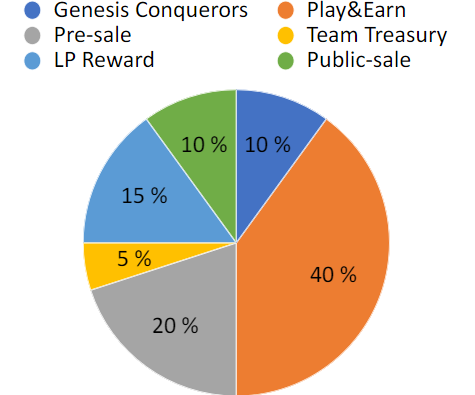

# j. Galactic Kingdom Citizenship 

Most games, Web 2 and Web 3 alike seem to like the dual token model. With one in-game currency and one « governance » token as they call it. However, we have yet to see a governance token that has any real governance power at all. And it is completely understandable, why would any serious game studios let everything they built for years into the hands of a very random « democracy ». However, there is still a great place for some kind of governance and thus governance of in-game assets.  One that would give real in-game utilities like the shared sinks but also have a real impact on the game itself in a fun way.
That is how we designed the Galactic Kingdom Citizenship token ($GKC).

$GKC will be a governance token on chain.
This token will give the player power over the Galactic Government and how they rule the universe of Galactic Kingdom.

Players will be able to burn some $GKC to order a Buster Call on an enemy planet for example. The extent of a Buster Call will be evaluated during the Alpha Testing phase.

Citizen Players (players that hold a minimum amount of $GKC) will be able to put bounties on dangerous Galactic Pirates and Galactic Revolutionaries.

Citizen Players will be able to vote, on how the Galactic Government Treasury (different from Team Treasury and different from BTC reserve) will be spent.

It could either be distributed to all $GKC holders proportionally invested in the BTC reserve or even burned.

The Galactic Government Treasury will be founded by all the NFTs with shared sink utilities they hold. 1/5 of the ten thousand Genesis Conquerors (two thousand) will be set apart for the Galactic Government. They will all be marines under the direct command of the GG. Also in consequence, 1/5 of Genesis Planets and Mothership will be set apart for the Galactic Government.

10% of any money raised through new pre-sale will be set aside for the Galactic Government Treasury ( That means any new NFT collections for Galactic Kingdom that might be extremely valuable)
Citizen Player will be able to vote on selling or buying Galactic Kingdoms NFTs to add to the GG control.
Even funnier, all the assets owned by the GG will be played under one special account that will be the one initiating Buster calls, emitting bounties, and new price guidelines for GSS (essentially being the main market maker for the GSS $GB pair in-game)

Every month Citizen players will be able to vote for someone to have access and control over the GG account. The selected person can be anyone even a famous pro game player. The selected person will be paid for his Job with the Galactic Government Treasure fund depending on his performance. His goal will be to play the evil GG that uses marines to attack other planets and thus choose what to build who to attack when to explore etc. This player won’t have any on-chain access obviously, it will only be a limited in-game account designed in a way to make any abuse attempt useless.

Therefore $GKC aims to be a real in-game governance token that has real shared sink utilities and whose value will be directly and inherently correlated to the game's success, unlike most governance tokens whose value are currently purely speculative. This token contrary to $GB will be available on CEXs, on DEXs everywhere reliable. 

$GKC will have a fixed max supply of 3 660 000 000.
There will be a private pre-sale for $GKC open to Genesis Conquerors first and then to other private interests.

Public sale will come not long after.

Most of the game tokens will be earned in-game or may be found in a much-coveted treasure;

Some will be for liquidity providing rewards.

A small part will be reserved for the team treasury 

The initial circulating supply will be the public Sale + 10% of the pre-sale. So 12% of the supply. A complete vesting timeline will be communicated later on.

Play&Earn will have a similar halving feature as $GB.

Each Genesis Conqueror will be able to earn 100 $GKC per day after the daily completion of a series of quests. These  $GKC earnings for Genesis Conqueror will only be for a limited period of 366 days. That will start along the linear vesting schedules of pre-sale.

